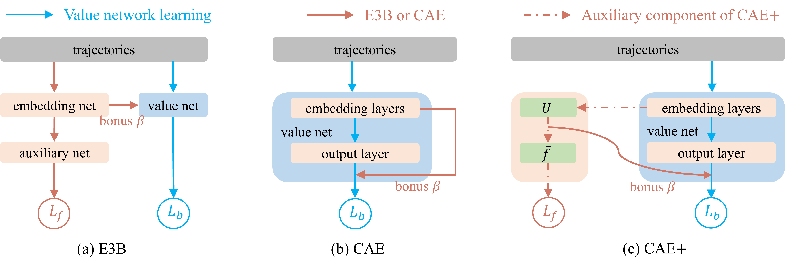

# CAE: Critic as an Explorer



## Overview

This repository contains the official implementation of **CAE: Critic as an Explorer**, a reinforcement learning exploration framework that repurposes the critic to guide exploration.

The repository provides implementations of the following methods:

- **CAE**
- **CAE+**
- **CAE+ without U**
- **Baseline E3B**

> ⚠️ **Note**: This repository is modified and extended from the open-source repository [E3B](https://github.com/facebookresearch/e3b).

---

## Installation

Create a conda environment and install the required dependencies:

```bash
conda create -n cae python=3.8
conda activate cae

cd CAE/
pip install -r requirements.txt --no-use-pep517
```

Make sure to install MiniHack following the instructions:

```
https://github.com/facebookresearch/minihack
```

---

## Training

All experiments are launched through `main.py`.

---

### Baseline E3B

Train an agent using the E3B baseline:

```bash
cd torchbeast/

# run
OMP_NUM_THREADS=1 python main.py \
  --learning_rate 0.0001 \
  --model e3b \
  --episodic_bonus_type elliptical-icm \
  --savedir ./results/elliptical/ \
  --env MiniHack-MultiRoom-N4-v0 \
  --ridge 0.1 \
  --reward_norm int \
  --intrinsic_reward_coef 1.0 \
  --seed 1 \
  --tensorboard_dir results/tensorboard
```

---

### CAE Variants

Train agents using CAE-based exploration methods:

```bash
cd torchbeast/

# CAE+
OMP_NUM_THREADS=1 python main.py \
  --learning_rate 0.0001 \
  --model caep \
  --episodic_bonus_type caep \
  --savedir ./results/elliptical/ \
  --env MiniHack-MultiRoom-N4-v0 \
  --ridge 0.1 \
  --reward_norm int \
  --intrinsic_reward_coef 1.0 \
  --seed 1 \
  --tensorboard_dir results/tensorboard \
  --weighted_emb_size 256

  
# CAE+ following the paper
OMP_NUM_THREADS=1 python main.py \
  --learning_rate 0.0001 \
  --model caep \
  --episodic_bonus_type caep_root \
  --savedir ./results/elliptical/ \
  --env MiniHack-MultiRoom-N4-v0 \
  --ridge 0.1 \
  --reward_norm int \
  --intrinsic_reward_coef 0.3 \
  --seed 1 \
  --tensorboard_dir results/tensorboard \
  --weighted_emb_size 256


# CAE
OMP_NUM_THREADS=1 python main.py \
  --learning_rate 0.0001 \
  --model cae \
  --episodic_bonus_type cae \
  --savedir ./results/elliptical/ \
  --env MiniHack-MultiRoom-N4-v0 \
  --ridge 0.1 \
  --reward_norm int \
  --intrinsic_reward_coef 1.0 \
  --seed 1 \
  --tensorboard_dir results/tensorboard


# CAE+ without U
OMP_NUM_THREADS=1 python main.py \
  --learning_rate 0.0001 \
  --model caep_wo_u \
  --episodic_bonus_type caep_wo_u \
  --savedir ./results/elliptical/ \
  --env MiniHack-MultiRoom-N4-v0 \
  --ridge 0.1 \
  --reward_norm int \
  --intrinsic_reward_coef 1.0 \
  --seed 1 \
  --tensorboard_dir results/tensorboard
```


> ⚠️ **Note**: For most tasks, the hyperparameter `--weighted_emb_size=256` serves as a reliable default. For simpler tasks, it can be reduced to 128, 64, or 32. If performance is unsatisfactory on more challenging tasks, consider increasing this value. In the paper, parameter statistics are reported using a mid-range configuration.
---

## Logging

Training outputs are saved under:

```
CAE/torchbeast/results/
```

TensorBoard logs:

```
CAE/torchbeast/results/tensorboard
```

Launch TensorBoard:

```bash
tensorboard --logdir ~/CAE/torchbeast/results/tensorboard/
```

---

## Citation

If you find this code useful in your research, please cite:

```bibtex
@article{li2026cae,
title    = {CAE: Repurposing the Critic as an Explorer in Deep Reinforcement Learning},
author   = {Yexin Li},
journal  = {Transactions on Machine Learning Research},
issn     = {2835-8856},
year     = {2026},
url      = {https://openreview.net/forum?id=54MOD02xC2}
}
```

---

## License

The majority of this project is licensed under **CC-BY-NC**.  
Please check individual files for specific license headers where applicable.

